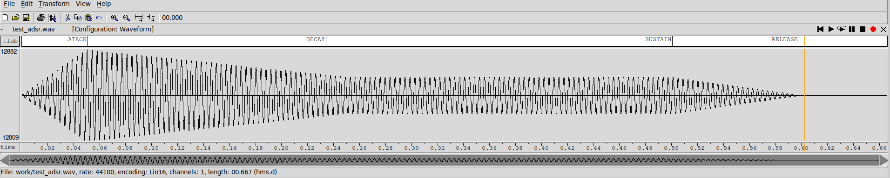
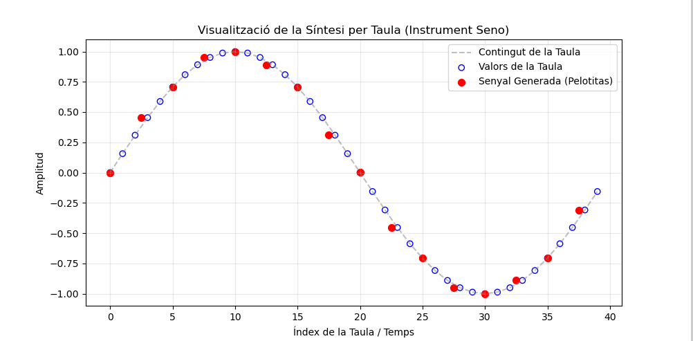

# Memoria de Práctica 5: Síntesis Musical Polifónica
**David Heredia, Carlos Vargas**

## 2. Envolvente ADSR
La envolvente ADSR (*Attack, Decay, Sustain, Release*) constituye el mecanismo de control dinámico primordial para modelar la evolución temporal de la amplitud de una señal. En nuestra implementación, el objeto `adsr` gestiona la transición entre estados basándose en la tasa de muestreo ($f_s = 44100$ Hz) y los parámetros definidos en el fichero de instrumentos:

*   **Attack (A):** Tiempo en segundos para que la señal alcance su valor pico (1.0) desde el inicio del evento *NoteOn* .
*   **Decay (D):** Tiempo para que la amplitud descienda desde el pico hasta el nivel de sostenido .
*   **Sustain (S):** Nivel de amplitud constante que se preserva mientras la tecla permanece pulsada.
*   **Release (R):** Tiempo de extinción del sonido una vez recibido el evento *NoteOff*.

Para confirmar que el ADSR funciona correctamente, utilizaremos una nota simple y suficientemente larga para apreciar una ADSR configurada con los siguientes parámetros para la funcion seno:  
InstrumentSeno   ADSR_A=0.05; ADSR_D=0.2; ADSR_S=0.4; ADSR_R=0.1;


*Figura 1: Envolvente ADSR genérica (ADSR_A=0.05; ADSR_D=0.2; ADSR_S=0.4; ADSR_R=0.1)*

## 2.1. Instrumento ADSR Genérico: Sawtooth con Filtro Paso Bajo
Para ilustrar el funcionamiento de una envolvente ADSR genérica, se ha implementado la clase InstrumentSaw. Este instrumento no se limita a generar una onda pura, sino que busca un sonido más complejo y "analógico" mediante las siguientes técnicas:

### Generación de la forma de onda (Sawtooth)
A diferencia de una sinusoide, la onda de diente de sierra es conocida en síntesis por ser muy rica en armónicos. En el constructor del instrumento, se inicializa una tbl de tamaño N que representa un ciclo completo de una rampa lineal que asciende desde -1.0 hasta 1.0.

### Cálculo de frecuencia y transposición
El método command() traduce la nota MIDI recibida a una frecuencia fundamental f 0​  utilizando la fórmula estándar Note=69+12⋅log 2 (f0​ /440). 
Para que sea mas grave,la frecuencia se divide por 4.0, lo que transpone el sonido dos octavas hacia abajo, convirtiéndolo en un sintetizador de bajos profundo.

### Implementación del Filtro Paso Bajo
Para suavizar el brillo agresivo de la onda de sierra, se ha incluido un filtro paso bajo de primer orden dentro del método synthesize(). La lógica utiliza una variable alpha fijada en 0.3 manualmente y la última muestra generada last_sample mediante la siguiente ecuación recursiva: 

$$x[i] = \alpha \cdot (\text{muestra\_actual}) + (1 - \alpha) \cdot x[i-1]$$

Este filtro suaviza las transiciones bruscas de la onda, eliminando componentes de alta frecuencia y otorgando un timbre más cálido al instrumento.


## 2.2. Instrumento Percusivo (Campana/Piano)
El modelado de instrumentos percusivos o de cuerda pulsada requiere una configuración donde el nivel de mantenimiento es nulo (S=0). El ataque es casi instantáneo (mínimo tiempo de subida) para simular el impacto inicial, seguido de una fase de caída prolongada.

- Situación 1: Extinción completa. Si el intérprete mantiene la nota pulsada, la fase de Decay actúa como una extinción natural hasta llegar a cero.
- Situación 2: NoteOff temprano. Si la nota se libera prematuramente, la envolvente entra inmediatamente en la fase de Release, provocando una atenuación abrupta.

Guardado como fm_campana.orc


## 2.3. Instrumento Plano (Clarinete)
Este perfil simula instrumentos de excitación continuam, es decir que tienen aire constante. Se caracteriza por un ataque rápido que alcanza el nivel de manteniendo una amplitud constante hasta que el evento de liberación activa un apagado rápido pero suave para evitar transitorios inarmónicos.

Guardado como fm_clarinete.orc

---

## 3. Instrumentos: Seno
### 3.1. Implementación del Instrumento Seno
El instrumento seno genera la señal mediante la búsqueda de valores en una tabla precargada de un ciclo senoidal.

### Método de asignación de valores
Para asignar un valor a la señal a partir de los contenidos en la tabla, se ha seguido un método de **redondeo al entero más cercano**. Dado que el incremento de fase necesario para alcanzar la frecuencia deseada no suele ser un número entero, el programa elige la muestra de la tabla más próxima a la fase actual.


*Figura 5: Visualización de la síntesis. Los círculos azules representan los valores originales de la tabla (N=40) y los puntos rojos las muestras reales generadas. Se observa cómo el redondeo introduce una ligera distorsión audible que podría mejorarse mediante interpolación lineal.*

---

## 4. Efectos Sonoros
### 4.1. Trémolo
El trémolo es una modulación de amplitud que varía periódicamente el volumen de la señal siguiendo una forma sinusoidal. Se rige por la siguiente ecuación:

$$x_r[n] = x_i[n] \cdot \frac{1 + A \cos(2\pi F_m n)}{1+A}$$

Donde **A** es la profundidad de modulación y $F_m$ la frecuencia de modulación normalizada ($f_m/f_s$). El factor de división asegura que la ganancia esté normalizada para evitar el *clipping*.

### 4.2. Vibrato
Consiste en la modulación periódica de la fase o frecuencia de la señal, simulando el movimiento rítmico que realizan los instrumentistas de cuerda sobre el mástil. El índice de modulación **I** se calcula a partir de la extensión en semitonos ($\nu$) mediante la relación de Chowning:

$$I = \frac{f_c}{f_m} \cdot \frac{2^{\nu/12}-1}{2^{\nu/12}+1}$$

Nuestra implementación utiliza un búfer circular para gestionar los retardos variables necesarios para el cambio de tono, manteniendo la causalidad mediante un retardo de segurida.

Ambos efectos pueden ser utilizados mediante la extension del comando **synth -e** y adjuntando uno o un conjunto de efectos en un archivo. Nosotros estubimos probando algunos en effects.orc.

---

## 5. Síntesis FM (Frequency Modulation)
### 5.1. Configuración de Parámetros
La síntesis FM permite generar timbres complejos mediante la interacción de una portadora ($f_c$) y una moduladora ($f_m$) . La relación armónica se define por el ratio $N_1/N_2 = f_c/f_m$, mientras que el índice de modulación **I** controla la riqueza tímbrica y el ancho de banda espectral.

Despues de buscar informacion y intentar distintas cosas, conseguimos hacer algunos sonidos interesantes, que estaran presentes en las orquestras finales que estan en el apartado 6.

---

## 6. Orquestación y Resultados Finales
### 6.1. You've got a friend in me (Toy Story)
Para esta pieza de Randy Newman, se ha optado por una orquestación con tres capas :
1.  **InstrumentSaw:** Melodía principal transpuesta dos octavas abajo para dar profundidad, aunque con un carácter algo melancólico debido a su timbre grave.
2.  **InstrumentFM:** Configurado para imitar el ataque y percusión de un piano.
3.  **InstrumentSeno:** Aporta detalles limpios y simples en el fondo.

**Comando de generación:**
```bash
synth -g 0.3 work/music/toystory.orc samples/ToyStory_A_Friend_in_me.sco work/music/toystory.wav
```
### 6.2. Orquestra Adicional (Gangsta’s Paradise)
Para este ejercicio de orquestación libre, se ha seleccionado el tema "Gangsta's Paradise". El proceso técnico seguido para su integración en el sintetizador es el siguiente:

#### 1. Obtención y conversión de la partitura
*   **Búsqueda del archivo MIDI:** Se obtuvo un archivo MIDI estándar de la canción desde una pagina web de google pública.
*   **Conversión a formato .sco:** Se ha utilizado el script `midi2sco` incluido en la práctica. Este script procesa los mensajes MIDI de tipo *NoteOn*, *NoteOff* y los cambios de tempo para generar un archivo de texto con el tiempo expresado en *ticks*, permitiendo que el programa `synth` lea la partitura de forma incremental.

#### 2. Diseño de la Orquesta (.orc)
Se han configurado cuatro canales con timbres distintos para cubrir las diferentes texturas de la canción [1]:
*   **Canal 1 - Melodía principal (InstrumentSaw):** Utiliza una onda de diente de sierra, rica en armónicos, ideal para sonidos con carácter.
*   **Canal 2 - Bajo (InstrumentFM):** Configurado para dar cuerpo a la base rítmica.
*   **Canal 3 - Base de acompañamiento (InstrumentDumb):** Instrumento sinusoidal básico que recorre una tabla de 40 muestras para reforzar la armonía con agudos.
*   **Canal 4 - Sawtooth épico:** Otro diente de sierra con un ataque más lento para añadir mayor profundidad y "epicidad" al conjunto.

#### 3. Resultados y ajuste de ganancia
El resultado final tiene un carácter muy **"metálico"**, similar al sonido de un videojuego antiguo debido a la gran cantidad de armónicos de las ondas de sierra. Para evitar el *clipping* y la distorsión al sumar tantos instrumentos, se ha configurado una ganancia general de **0.1** .

**Comando de generación:**
```bash
synth -g 0.1 work/instrumentos_gp.orc work/gp.sco gp.wav
```

## Conclusiones 

Más allá de la música, la práctica ha sido un curso intensivo de teoría musical, síntesis e integración de sistemas. Hemos aprendido mucho sobre la organización del entorno de trabajo de un programador y además lo hemos hecho programando y personalizando nuestros propios instrumentos y efectos con diversas funciones. Después de ajustar mil veces cada instrumento, esperamos que no se nos haya colado alguna distorsión…
